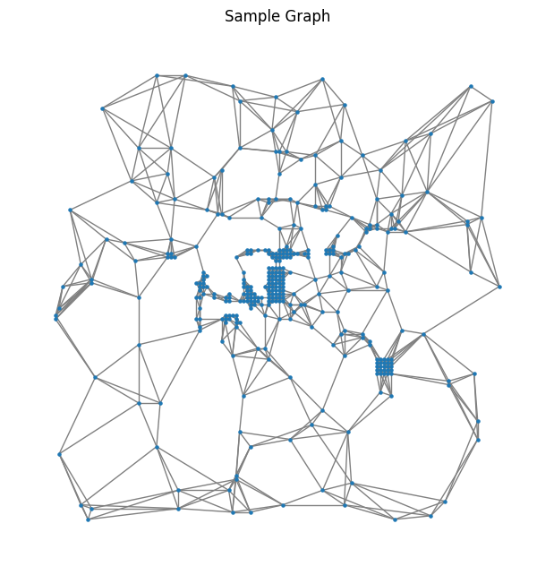

# Common Task 2: Jets as graphs

## Overview
This project is part of Common Task 2, where a Graph Neural Network (GNN) is used to classify quark/gluon jet events. The original dataset consists of 3-channel images (ECAL, HCAL, and Tracks), which are converted into point clouds and further transformed into graphs. A **GraphSAGE** model is then trained to classify these jet events.

## Dataset
The dataset consists of 125x125 pixel images with three channels:
- **ECAL (Electromagnetic Calorimeter)**
- **HCAL (Hadronic Calorimeter)**
- **Tracks**

Each sample represents a jet event, and the dataset is stored in an HDF5 file (`quark-gluon_data-set_n139306.hdf5`).

## Data Processing

### 1. Splitting the Dataset
The dataset is processed into a graph structure by batching nodes and edges using `torch_geometric.data.Data`.  
Each graph sample corresponds to a jet event.

### 2. Normalizing Point Cloud Features
- The dataset undergoes global standardization using `StandardScaler()`.
- Each **ECAL, HCAL, and Tracks channel** is independently normalized to ensure consistency across different jet events.

### 3. Converting Images to Point Clouds
- The **non-zero pixels** in the dataset images are extracted as (x, y) coordinates.
- The extracted features are normalized using the scalers.
- The resulting point cloud representation preserves the spatial structure of the jet events.

### 4. Constructing Graphs
- A K-Nearest Neighbors (KNN) graph is built using `k=5`, where each node connects to its 5 nearest neighbors.
- The edge list is created based on spatial proximity.
- Each edge stores **Euclidean distance** and **feature differences** as attributes.

### 5. Processing the Graph Dataset
- Each image is converted into a graph with nodes representing features of active pixels.
- All graphs are batched together into a `torch_geometric.data.Data` object for efficient processing in PyTorch Geometric.

## Sample Graph Visualization
Below is a sample graph structure generated from a single quark/gluon jet event.

## Model Architecture

The model is based on **GraphSAGE**, a Graph Neural Network (GNN) designed for graph-based classification.

### **GraphSAGE Model**
- *Graph Convolution Layers:
  - 5 layers of `SAGEConv` for message passing and feature extraction.
  - Each layer applies LayerNorm and ReLU activation.
  - residual connections are used for stable training.
- Pooling & Classification:
  - Global Max Pooling aggregates graph-level representations.
  - A fully connected layer outputs 2-class predictions (quark vs. gluon).
- Dropout (0.3) is applied for **regularization**.

## Training Details

- Loss Function: Cross-Entropy Loss  
- Optimizer: Adam (`lr=1e-3`, `weight_decay=5e-5`)  
- Scheduler: Cosine Annealing LR with Warm-up (`80 epochs`)  
- Batch Size: 32  
- Epochs: 80  

## Results

### **Training & Test Loss**
*(You can add a loss curve image here)*

### **Training & Test Accuracy**
*(You can add an accuracy curve image here)*

### **Final Test Accuracy**
- The best model is evaluated on the **test set**.
- **Final test accuracy: X.XXX%** *(Replace with your actual result)*.

