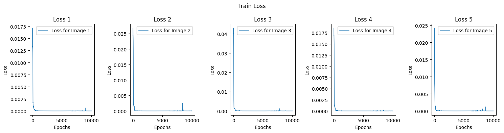
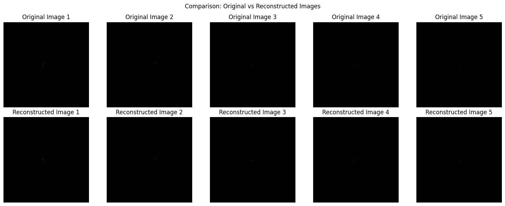

# Specific Task 2: Implicit Neural Representations (INR) for Quark/Gluon Jet Images

## Overview
This project is part of Specific Task 2, where Implicit Neural Representations (INRs) are used to model and reconstruct quark/gluon jet images. The INR model maps continuous spatial coordinates to pixel intensity values, allowing for efficient image representation and reconstruction. The model is evaluated using PSNR, SSIM, and LPIPS metrics.

## Dataset
The dataset consists of **125x125 pixel images** with three channels:
- **ECAL (Electromagnetic Calorimeter)**
- **HCAL (Hadronic Calorimeter)**
- **Tracks**

Each sample represents a jet event, and the dataset is stored in an HDF5 file (`quark-gluon_data-set_n139306.hdf5`).

## Data Processing

### 1. Positional Encoding
- To enhance the model's ability to learn high-frequency details, **positional encoding** is applied to the input coordinates.
- The encoding expands the 2D coordinates into a **higher-dimensional representation** using **sinusoidal functions**.

### 2. Normalization and Dataset Preparation
- The dataset is **normalized** using the global mean and standard deviation.
- Each image is converted into a dataset where:
  - **Input:** 2D spatial coordinates `(x, y)`.
  - **Output:** Corresponding pixel intensity values `(R, G, B)`.
- The dataset is loaded into a PyTorch `DataLoader` for efficient batch processing.

## Model Architecture

### Implicit Neural Representation (INR) Model
The model is a **fully connected feedforward network (FFN)** with positional encoding:
- **Input:** 2D spatial coordinates with positional encoding.
- **Hidden Layers:** Fully connected layers with ReLU activation.
- **Output:** Reconstructed RGB pixel values.

## Training Details

- Loss Function: Mean Squared Error (MSE) Loss  
- Optimizer: AdamW (`lr=1e-3`, `weight_decay=5e-5`)  
- Scheduler: Cosine Annealing LR (`10,000 epochs`)  
- Gradient Scaling: Automatic Mixed Precision (AMP) for stability  
- Batch Size: 1 (per image)  

## Results

### Training Loss

### Original vs Reconstructed Images

### Evaluation
The model's reconstruction quality is evaluated using three key metrics:

- **PSNR (Peak Signal-to-Noise Ratio, in dB)**
  - Measures the similarity between the original and reconstructed images.
  - Higher values indicate better reconstruction quality.
  - Typical range:
    - **30 dB – 50 dB:** Good reconstruction.
    - **50 dB+:** High-fidelity reconstruction.

- **SSIM (Structural Similarity Index)**
  - Evaluates structural similarity between the original and reconstructed images.
  - Higher values (close to 1) indicate more perceptually similar images.
  - Range:
    - **0 – 1**, where 1 means perfect similarity.

- **LPIPS (Learned Perceptual Image Patch Similarity)**
  - Measures perceptual difference between images using deep features.
  - Lower values indicate better perceptual similarity.
  - Range:
    - **0 – 1**, where 0 means no perceptual difference.

#### Results Table
| Sample Image | PSNR (dB) | SSIM | LPIPS |
|-------------|-----------|------|--------|
| 1           | 57.93     | 0.9982 | 0.0072 |
| 2           | 55.28     | 0.9971 | 0.0139 |
| 3           | 53.10     | 0.9973 | 0.0735 |
| 4           | 56.84     | 0.9981 | 0.0130 |
| 5           | 57.10     | 0.9974 | 0.0367 |

- **Interpretation:**
  - All PSNR values are **above 50 dB**, indicating **high-fidelity reconstruction**.
  - SSIM values **approach 1**, meaning **very high structural similarity**.
  - LPIPS values are **close to 0**, confirming that the reconstructed images are **perceptually similar** to the originals.

